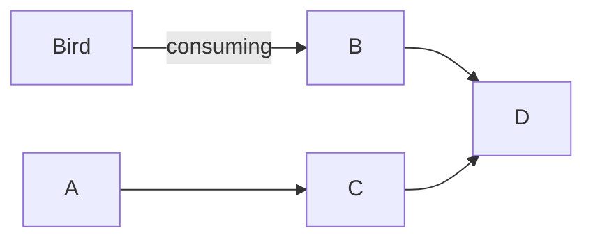

# icddr,b

## Early Disease Detection System

### Categories
- Poultry
- Wild Bird
- LMB

```php

if(){
    // statement
}else{

}
```


```bash
git int
git commit

```

# Flow chart


# Dashboard 

### Effected By Location

| Locaion | Bird | Wild Bird | LBW |

| Dhaka | 5 | 10 | 20 |
| Chittagong | 5 | 10 | 20 |
| Khulna | 5 | 10 | 20 |

